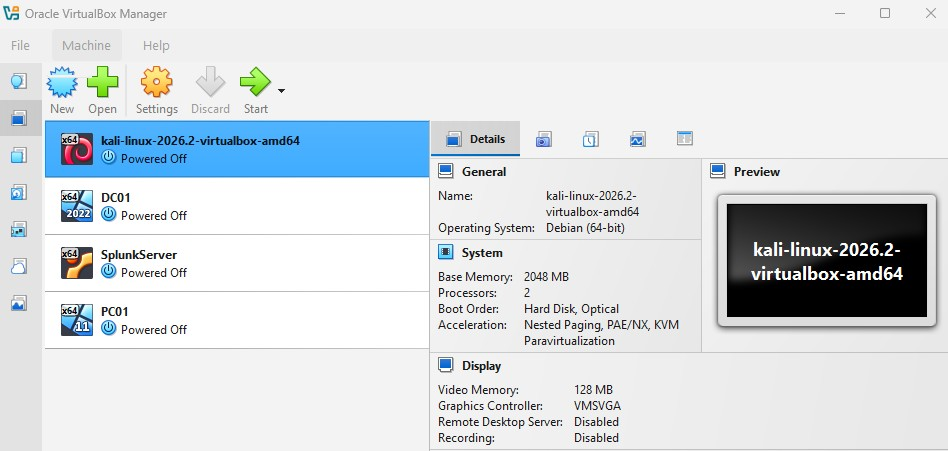

# Lab Environment

## Overview

The project was built as a fully virtualized cybersecurity lab using
Oracle VirtualBox. Four virtual machines were deployed to represent
different systems within the environment.

| Host | Operating System | Purpose |
|---|---|---|
| DC01 | Windows Server 2022 | Active Directory Domain Controller |
| PC01 | Windows 11 | Domain-joined endpoint |
| SplunkServer | Ubuntu Server | Centralized Splunk SIEM |
| Kali Linux | Kali Linux | Security testing workstation |

## Virtual Environment

All four systems were deployed in Oracle VirtualBox and connected
through the same virtual NAT network.

This architecture allowed Windows administration, endpoint monitoring,
centralized log collection, and controlled security testing to be
performed within an isolated lab.
