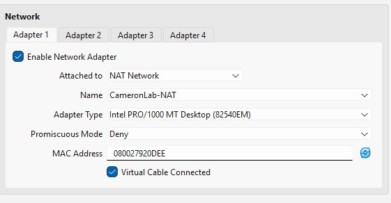
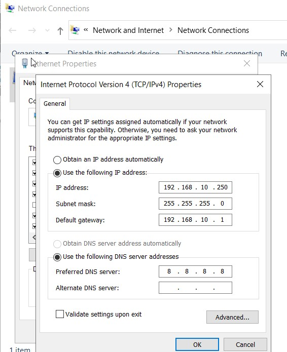
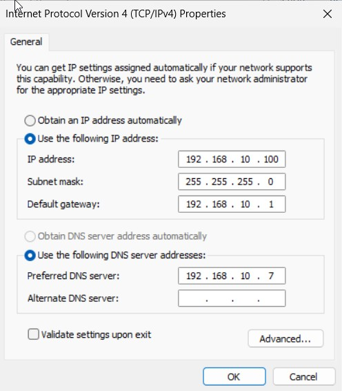
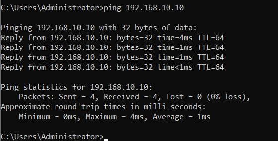

# Network Configuration

## Network Design

A VirtualBox NAT network named `CameronLab-NAT` was created using the
following address space:

- Network: `192.168.10.0/24`
- Default Gateway: `192.168.10.1`

All virtual machines were connected to the CameronLab NAT network.

## Static IP Addressing

| System | IP Address | Role |
|---|---|---|
| DC01 | `192.168.10.7` | Domain Controller / DNS |
| SplunkServer | `192.168.10.10` | Splunk Enterprise |
| PC01 | `192.168.10.100` | Windows Endpoint |
| Kali Linux | `192.168.10.250` | Security Testing |

The Splunk server was configured with a static IP address.

DC01 was configured with a static IP address to provide consistent
domain and DNS services within the lab.

PC01 was configured to use the Domain Controller at `192.168.10.7`
as its DNS server so that the `cameronlab.local` Active Directory
domain could be resolved.

Kali Linux was assigned the static IP address `192.168.10.250`
for use as the security-testing workstation.

## Connectivity Verification

Connectivity between DC01 and the Splunk server was verified using ICMP.

