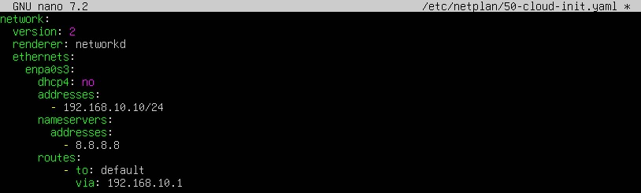
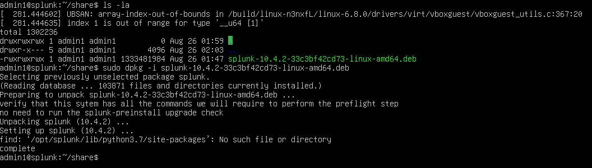
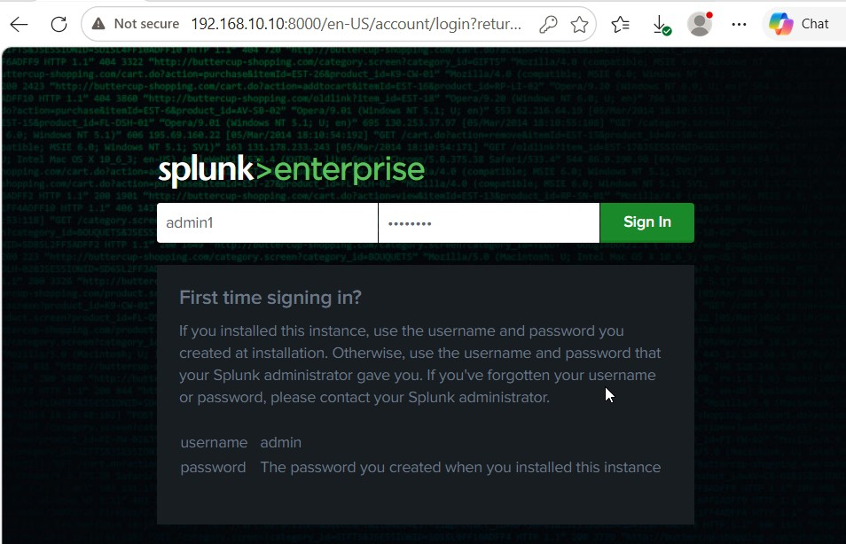
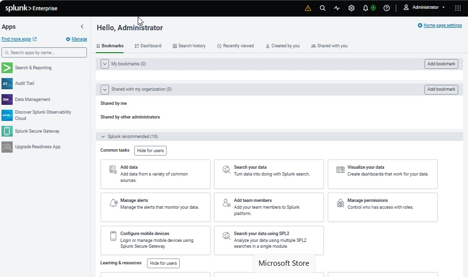

# Splunk Enterprise Deployment

## Objective

Splunk Enterprise was deployed as the centralized SIEM platform for
the lab. The server receives Windows event telemetry from monitored
endpoints and provides a centralized interface for searching and
investigating the data.

## Server Configuration

The Splunk server was assigned the static IPv4 address:

`192.168.10.10/24`

## Splunk Installation

The Linux user was added to the VirtualBox shared-folder group so the
Splunk installation package could be accessed from the virtual machine.

Splunk Enterprise was then installed on the Ubuntu server.

## Splunk Web

The Splunk web interface was accessed using:

`http://192.168.10.10:8000`

The Splunk login page confirmed that the web service was reachable.

After authentication, the Splunk Enterprise dashboard was successfully
loaded.

The successful login confirmed that the Splunk Enterprise instance
was operational and ready to receive endpoint telemetry.

## Endpoint Data Verification

An `index=endpoint` search was used to verify that Windows event data
was being received by the Splunk server.

Splunk also displayed the monitored Windows hosts sending data to the
centralized server.

