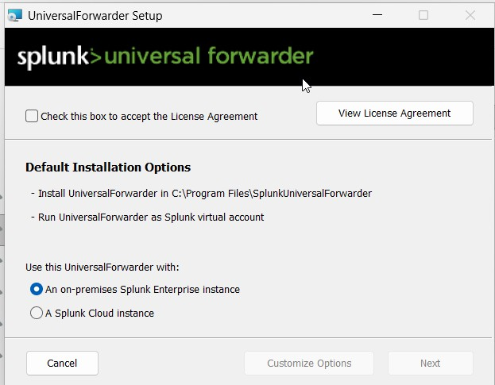
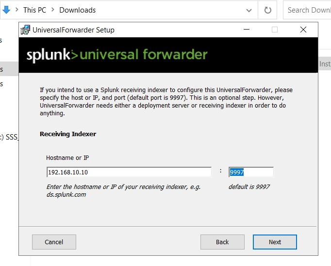
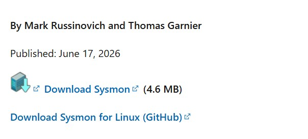
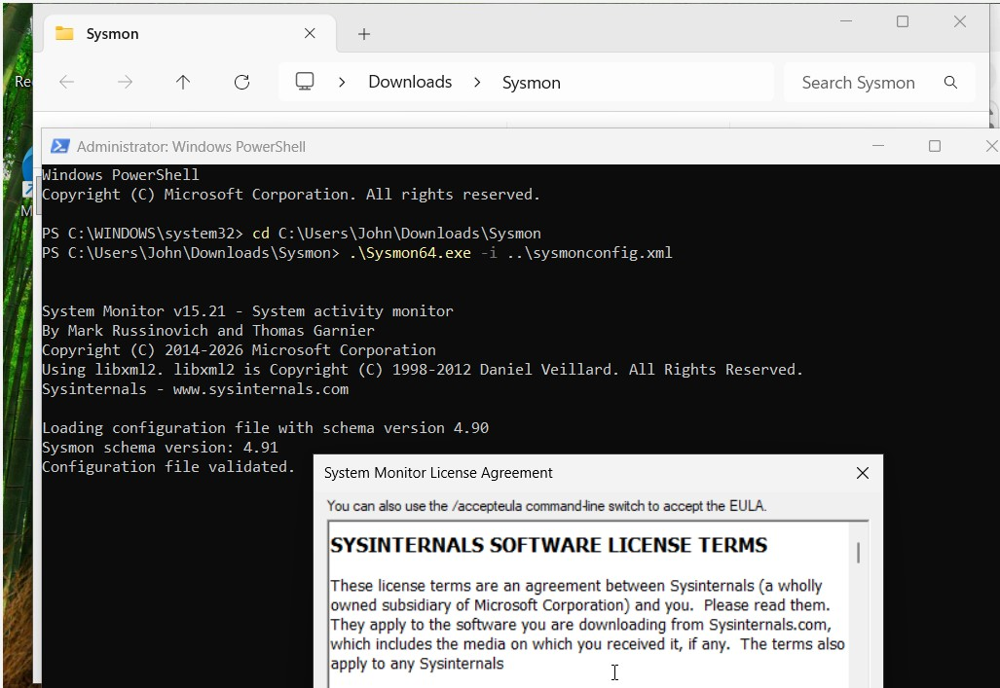
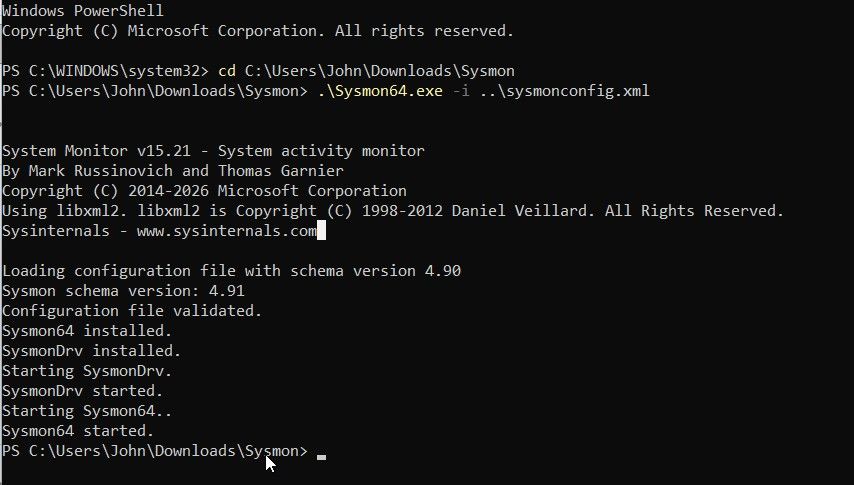
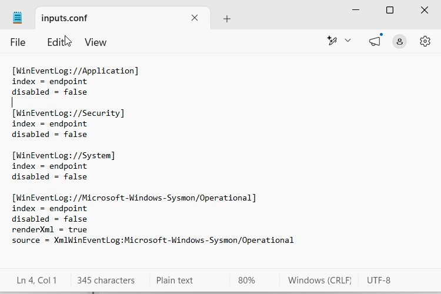
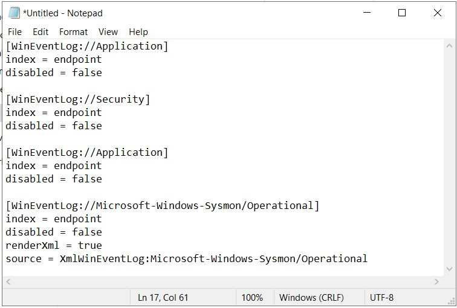
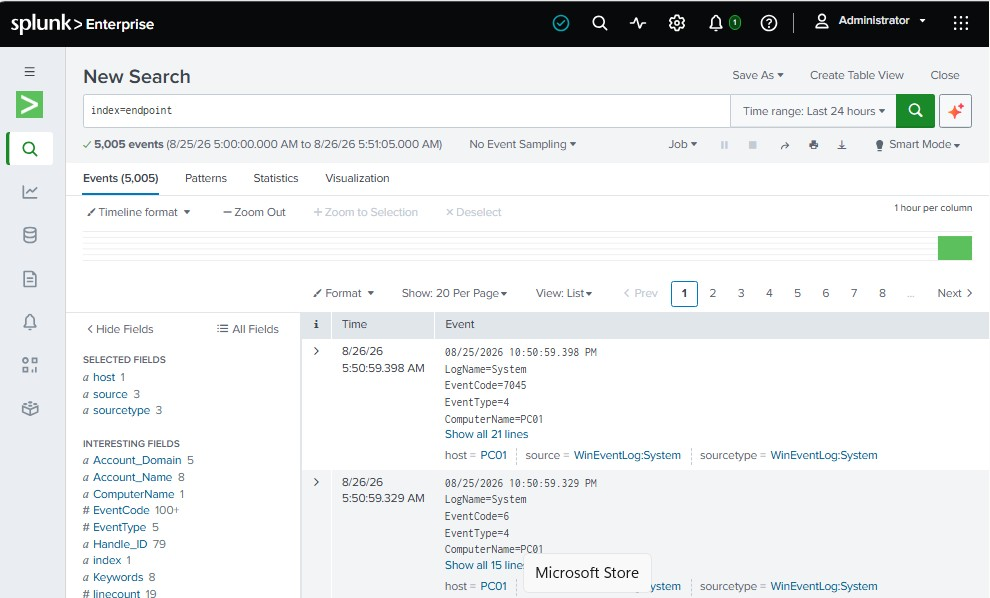
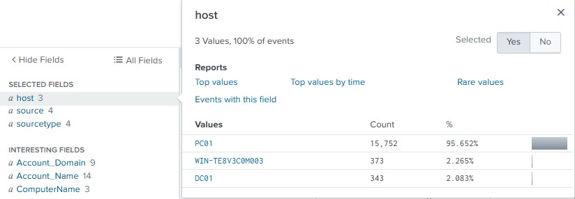
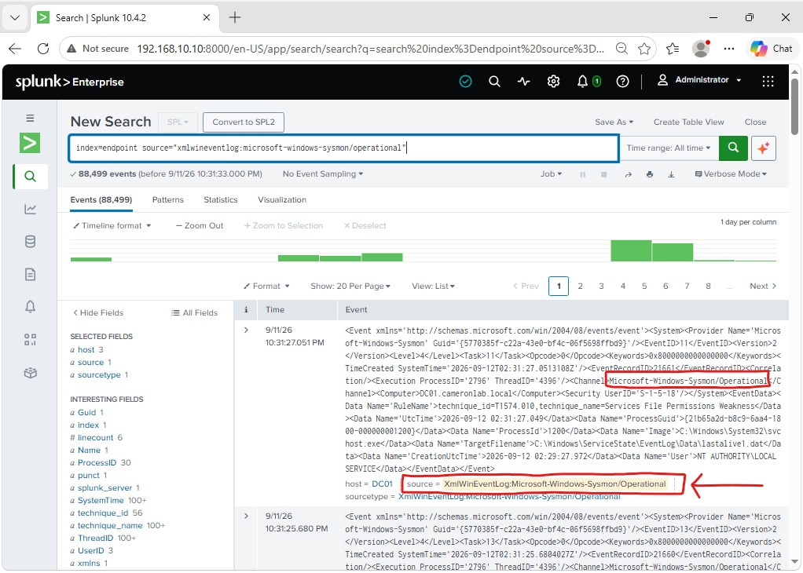

# Endpoint Telemetry Collection

## Overview

Windows telemetry from PC01 and DC01 was centralized in Splunk Enterprise
using the Splunk Universal Forwarder. Microsoft Sysmon was also deployed
to provide additional endpoint-level telemetry.

The telemetry pipeline used in the lab was:

**Windows Endpoint**  
↓  
**Windows Event Logs / Sysmon**  
↓  
**Splunk Universal Forwarder**  
↓  
**TCP 9997**  
↓  
**Splunk Enterprise**

---

## Splunk Universal Forwarder

Splunk Universal Forwarder was installed on the Windows systems to
collect and forward endpoint telemetry to the centralized Splunk server.



The forwarder was configured to send data to the Splunk Enterprise
server at:

`192.168.10.10:9997`



---

## Sysmon Deployment

Microsoft Sysmon was downloaded and deployed to provide additional
endpoint telemetry beyond the standard Windows Event Logs.



Sysmon was installed on the Windows endpoint using a custom
configuration file.



The successful installation confirmed that the Sysmon service and
driver were running on the Windows system.



---

## Splunk Input Configuration

The Splunk Universal Forwarder was configured through `inputs.conf`
to collect several Windows event sources.

The configured sources included:

- Application Event Log
- Security Event Log
- System Event Log
- Microsoft Sysmon Operational Log



The configuration instructed the Universal Forwarder to send the
selected Windows Event Logs and Sysmon telemetry to the `endpoint`
index in Splunk.



The complete configuration used in the lab is available here:

[View inputs.conf](../configs/splunk/inputs.conf)

The custom `inputs.conf` configuration defines **which telemetry is
collected** from the Windows systems.

---

## Splunk Output Configuration

The Universal Forwarder was also configured through `outputs.conf`
to define the destination Splunk Enterprise server.

The forwarder sends collected telemetry to:

`192.168.10.10:9997`

The complete output configuration is available here:

[View outputs.conf](../configs/splunk/outputs.conf)

The relationship between the two configuration files is:

```text
inputs.conf
    ↓
Defines which logs are collected
    ↓
Splunk Universal Forwarder
    ↓
outputs.conf
    ↓
Defines where the logs are sent
    ↓
192.168.10.10:9997
    ↓
Splunk Enterprise
```

---

## Windows Event Log Verification

To verify that Windows event data was reaching the SIEM, the
`endpoint` index was queried in Splunk:

```spl
index=endpoint
```

The search returned events from the monitored Windows systems,
confirming that the Splunk Universal Forwarder was successfully
sending Windows Event Log data to the centralized Splunk server.



Splunk also showed multiple monitored Windows hosts reporting into
the environment.



---

## Sysmon Telemetry Verification

To verify that Sysmon telemetry was successfully reaching Splunk, the
Sysmon Operational event source was queried using:

```spl
index=endpoint source="XmlWinEventLog:Microsoft-Windows-Sysmon/Operational"
```

The search returned Sysmon events from the monitored Windows systems,
confirming that Sysmon telemetry was successfully collected by the
Splunk Universal Forwarder and ingested into Splunk Enterprise.



This verified the complete Sysmon telemetry pipeline:

```text
Windows Activity
    ↓
Sysmon
    ↓
Microsoft-Windows-Sysmon/Operational
    ↓
Splunk Universal Forwarder
    ↓
Splunk Enterprise
    ↓
endpoint index
```

---

## Configuration Files

The Splunk Universal Forwarder configuration used in this project is
included in the repository:

- [inputs.conf](../configs/splunk/inputs.conf) — defines the Windows Event Log and Sysmon sources collected by the forwarder.
- [outputs.conf](../configs/splunk/outputs.conf) — defines the Splunk Enterprise receiver at `192.168.10.10:9997`.

---

## Result

The endpoint telemetry pipeline successfully centralized native Windows
Event Logs and Sysmon telemetry in Splunk Enterprise.

This configuration provided centralized visibility into:

- Windows application events
- Windows security events
- Windows system events
- Sysmon endpoint telemetry
- Authentication activity
- Endpoint-generated security events

The collected telemetry was later used to investigate authentication
activity generated during the controlled security-testing portion of
the lab.
