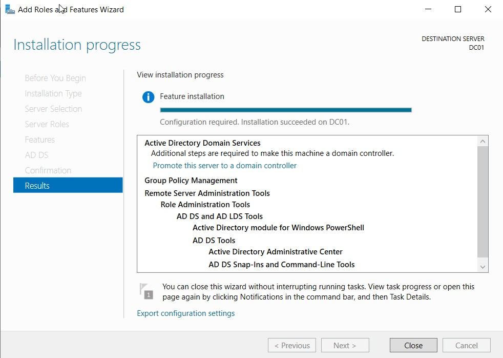

# Active Directory Deployment

## Active Directory Domain Services

Active Directory Domain Services was installed on the Windows Server
2022 system.

The server was then promoted to a Domain Controller for the domain:

`cameronlab.local`

The Domain Controller was named:

`DC01`

## Domain Controller Networking

DC01 was configured with the static IP address:

`192.168.10.7`

This system also provided DNS services for domain-connected systems.

## Domain Verification

After promotion, the Windows Server login interface displayed the
`CAMERONLAB` domain, confirming that the Active Directory domain had
been successfully created.

