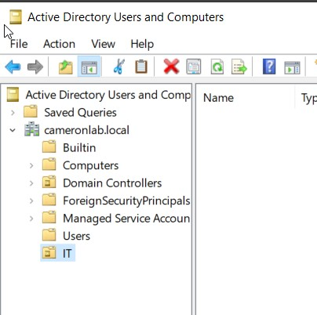
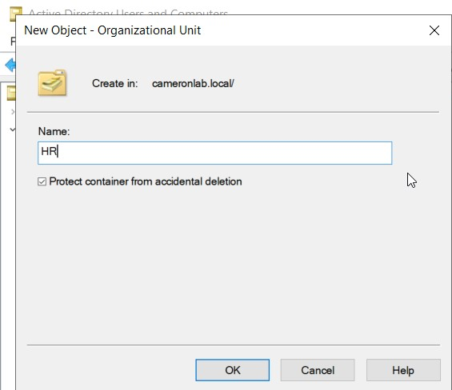
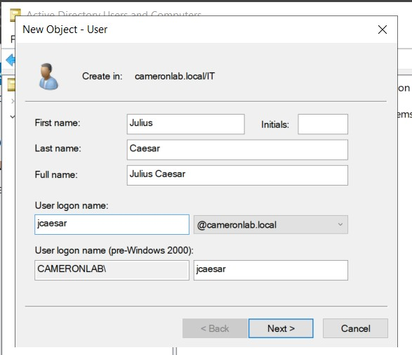
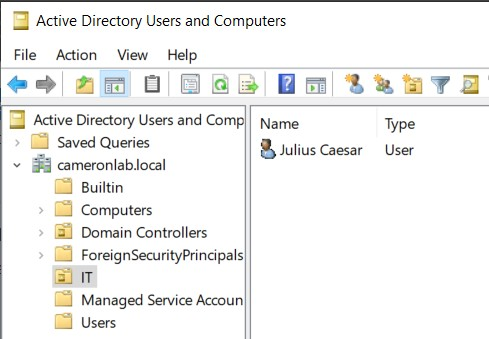
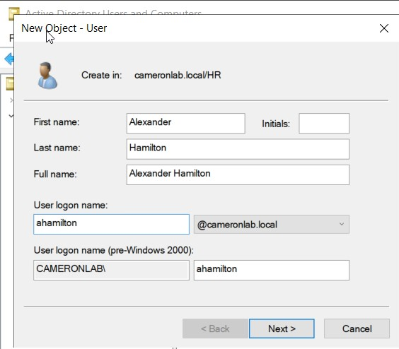
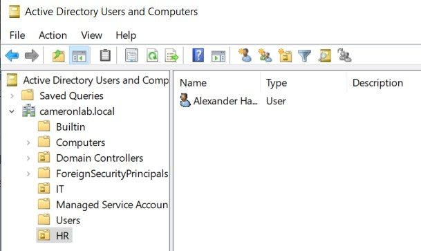
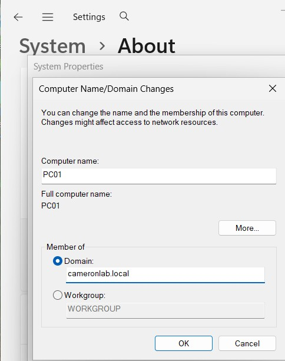
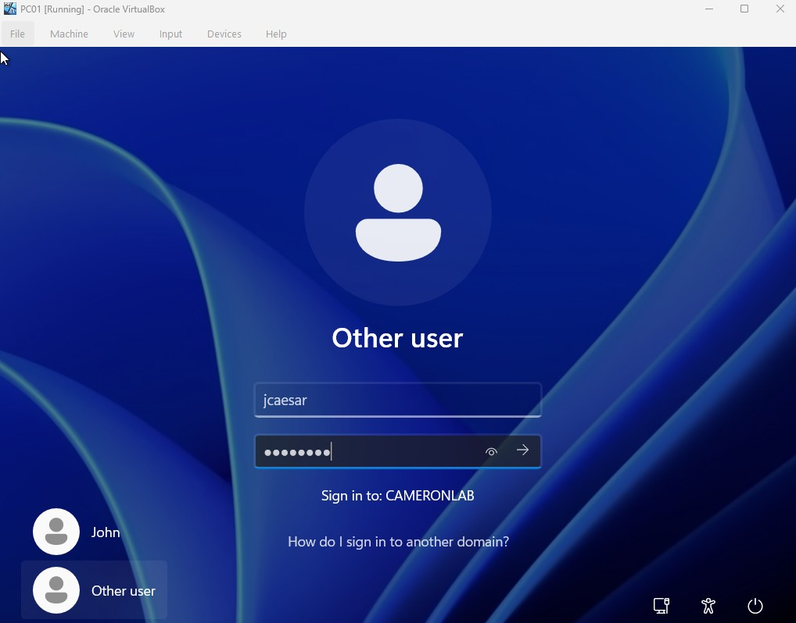
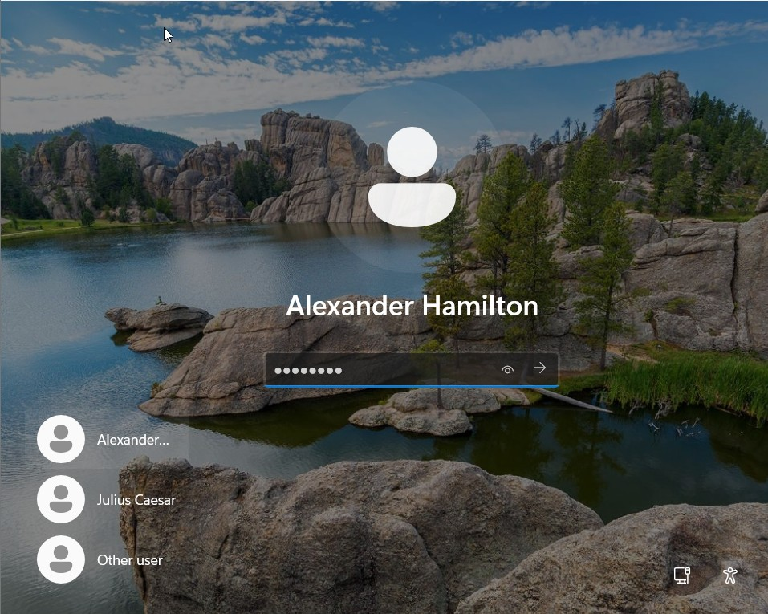
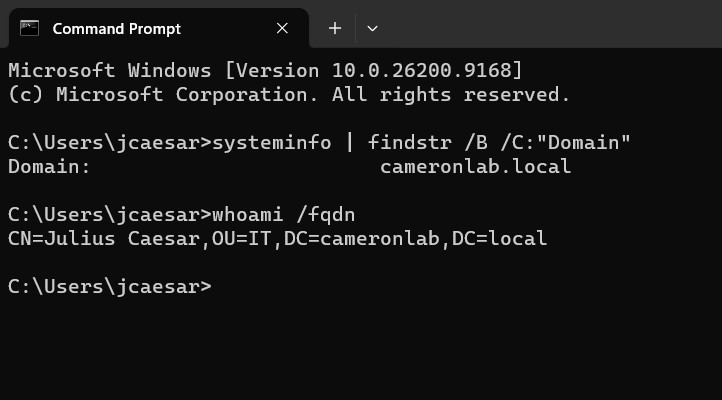

# Domain Users and Endpoint Integration

## Overview

After deploying the `cameronlab.local` Active Directory domain, departmental
Organizational Units (OUs) and domain user accounts were created to simulate
basic enterprise identity management.

The Windows 11 endpoint, PC01, was then joined to the domain and used to verify
authentication with the newly created domain accounts.

---

## Organizational Units

Two Organizational Units were created within `cameronlab.local`:

- IT
- HR

The IT Organizational Unit was created first.



A separate HR Organizational Unit was also created to represent another
department within the environment.



The resulting domain structure included:

| Organizational Unit | Example User | Username |
|---|---|---|
| IT | Julius Caesar | `jcaesar` |
| HR | Alexander Hamilton | `ahamilton` |

---

## IT Domain User

A domain user named **Julius Caesar** was created inside the IT
Organizational Unit.



The completed account was visible within the IT OU in Active Directory Users
and Computers.



**Username:** `jcaesar`  
**Domain:** `cameronlab.local`  
**Organizational Unit:** `IT`

---

## HR Domain User

A second domain user named **Alexander Hamilton** was created inside the HR
Organizational Unit.



The completed account was visible within the HR OU.



**Username:** `ahamilton`  
**Domain:** `cameronlab.local`  
**Organizational Unit:** `HR`

---

## PC01 Domain Join

PC01 was configured to use DC01 as its DNS server and was then joined to the
Active Directory domain:

`cameronlab.local`



Joining PC01 to the domain allowed Active Directory accounts created on DC01
to authenticate to the Windows 11 endpoint.

---

## Domain Authentication Testing

Authentication was tested using the newly created domain accounts.

### Julius Caesar

The `jcaesar` account successfully authenticated to PC01 using the
`CAMERONLAB` domain.



### Alexander Hamilton

The `ahamilton` account was also successfully authenticated on PC01.



---

## Domain Membership Verification

Windows command-line utilities were used to verify that PC01 belonged to the
correct Active Directory domain.

```cmd
systeminfo | findstr /B /C:"Domain"
```

The command returned:

```text
Domain: cameronlab.local
```

The Fully Qualified Distinguished Name (FQDN) of the currently authenticated
user was also verified using:

```cmd
whoami /fqdn
```

### HR User Verification

For Alexander Hamilton, the command returned:

```text
CN=Alexander Hamilton,OU=HR,DC=cameronlab,DC=local
```


This confirmed that the user belonged to the HR Organizational Unit within the
`cameronlab.local` domain.

### IT User Verification

For Julius Caesar, the command returned:

```text
CN=Julius Caesar,OU=IT,DC=cameronlab,DC=local
```



This confirmed that the user belonged to the IT Organizational Unit.

---

## Result

The Active Directory identity environment was successfully validated by:

- Creating separate IT and HR Organizational Units
- Provisioning domain users within the appropriate OUs
- Joining PC01 to `cameronlab.local`
- Authenticating to PC01 with Active Directory accounts
- Verifying domain membership from the Windows command line
- Confirming each user's Distinguished Name and OU placement

This established a functional domain environment that could later be used for
controlled authentication testing and centralized security monitoring through
Splunk.
