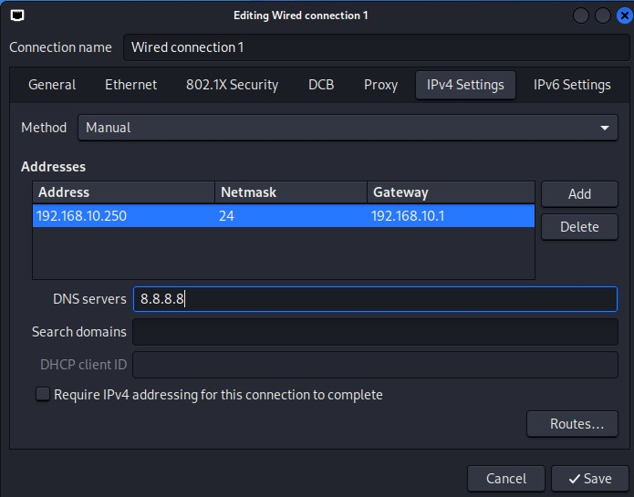
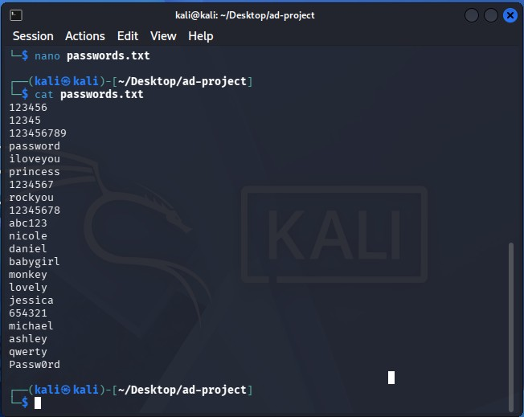
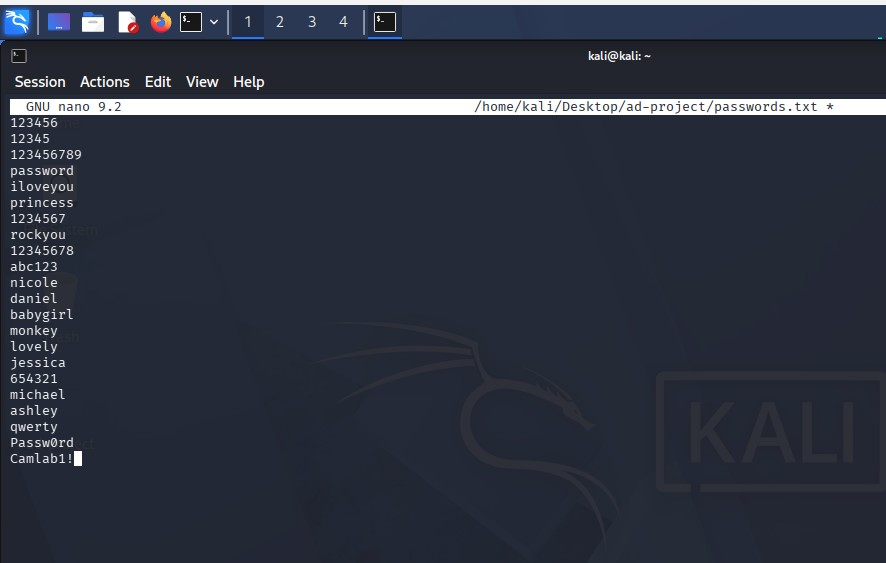
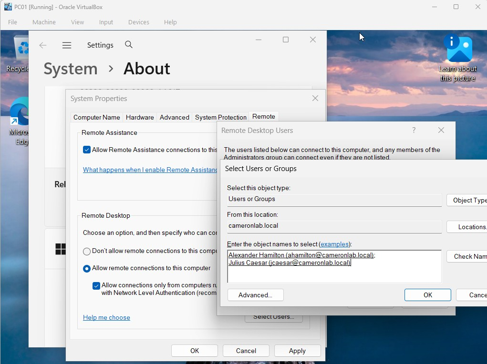

# Controlled RDP Authentication Testing with Hydra

## Overview

After configuring the Active Directory environment and centralized Splunk
logging, Kali Linux was used as a security-testing workstation to generate
controlled RDP authentication activity against the Windows 11 endpoint,
PC01.

The objective was to simulate repeated password-guessing attempts within the
isolated lab and then determine whether the resulting authentication activity
could be identified and investigated through Splunk.

All testing was performed against virtual machines created specifically for
this lab environment.

---

## Test Environment

The authentication test involved the following systems:

| System | Role | IP Address |
|---|---|---|
| Kali Linux | Security-testing workstation | `192.168.10.250` |
| PC01 | Windows 11 domain endpoint | `192.168.10.100` |
| DC01 | Active Directory Domain Controller | `192.168.10.7` |
| Splunk Server | Centralized SIEM | `192.168.10.10` |

The Active Directory domain used throughout the test was:

`cameronlab.local`

---

## Kali Linux Configuration

Kali Linux was configured with the static IPv4 address:

`192.168.10.250`

This provided a consistent source address that could later be correlated
with Windows authentication events inside Splunk.



---

## Authentication Test Preparation

A dedicated project directory was created on the Kali Linux workstation to
store files used during the authentication test.

A password wordlist named `passwords.txt` was created inside the project
directory.



The wordlist contained multiple candidate passwords, including the password
assigned to the test domain account (<font color="red"><strong>Camlab1!</strong></font>).



Using a controlled wordlist allowed the lab to generate several failed
authentication attempts followed by a successful authentication.

---

## RDP Configuration on PC01

Remote Desktop was enabled on PC01 so that the selected Active Directory
accounts could authenticate through RDP.

The domain users used during the test were granted Remote Desktop access to
the Windows 11 endpoint.



The target endpoint used during the test was:

`192.168.10.100`

---

## Hydra RDP Authentication Test

Hydra was used from the Kali Linux workstation to perform controlled RDP
password guessing against the `ahamilton` Active Directory account on PC01.

The test targeted:

- **Account:** `ahamilton@cameronlab.local`
- **Target:** `192.168.10.100`
- **Protocol:** RDP
- **Password source:** `passwords.txt`

The command used during the lab was:

```bash
hydra -t 1 -W 1 -l "ahamilton@cameronlab.local" \
-P /home/kali/Desktop/ad-project/passwords.txt \
rdp://192.168.10.100
```

Hydra attempted passwords from the supplied wordlist until a valid
credential was identified.


The successful result confirmed that the authentication-testing workflow was
working and, more importantly, generated both failed and successful Windows
authentication events for later analysis.

---

## Telemetry Generated

The controlled authentication activity generated Windows Security events on
PC01.

The most relevant authentication events included:

| Event ID | Description |
|---|---|
| `4625` | Failed account logon |
| `4624` | Successful account logon |

Because PC01 was already configured with the Splunk Universal Forwarder,
these authentication events were sent to the centralized Splunk Enterprise
server for analysis.

The test therefore produced the following workflow:

```text
Kali Linux
192.168.10.250
      ↓
Hydra RDP Authentication Attempts
      ↓
PC01
192.168.10.100
      ↓
Windows Security Event Logs
      ↓
Splunk Universal Forwarder
      ↓
Splunk Enterprise
192.168.10.10
```

---

## Result

The controlled Hydra test successfully generated authentication activity
against PC01 that could be observed through Windows Security logging and
centralized in Splunk.

The test demonstrated:

- RDP configuration for Active Directory domain users
- Kali Linux security-testing workflow
- Password wordlist preparation
- Controlled password-guessing activity using Hydra
- Generation of failed and successful Windows authentication events
- Integration between endpoint authentication activity and centralized SIEM
  monitoring

The resulting events were then analyzed in the Splunk investigation portion
of the project.
