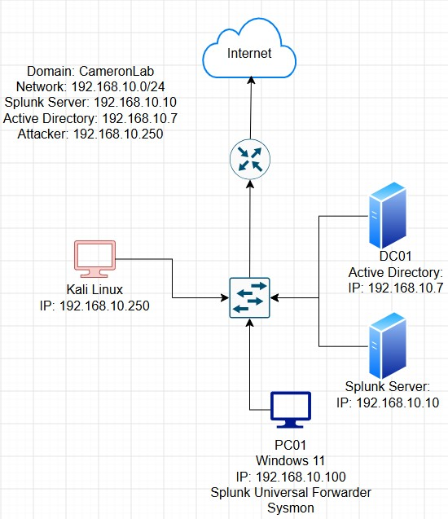
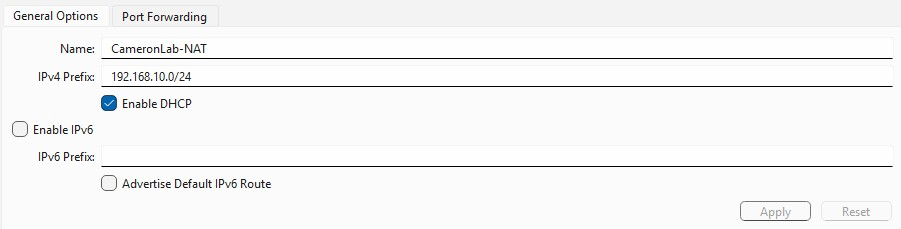
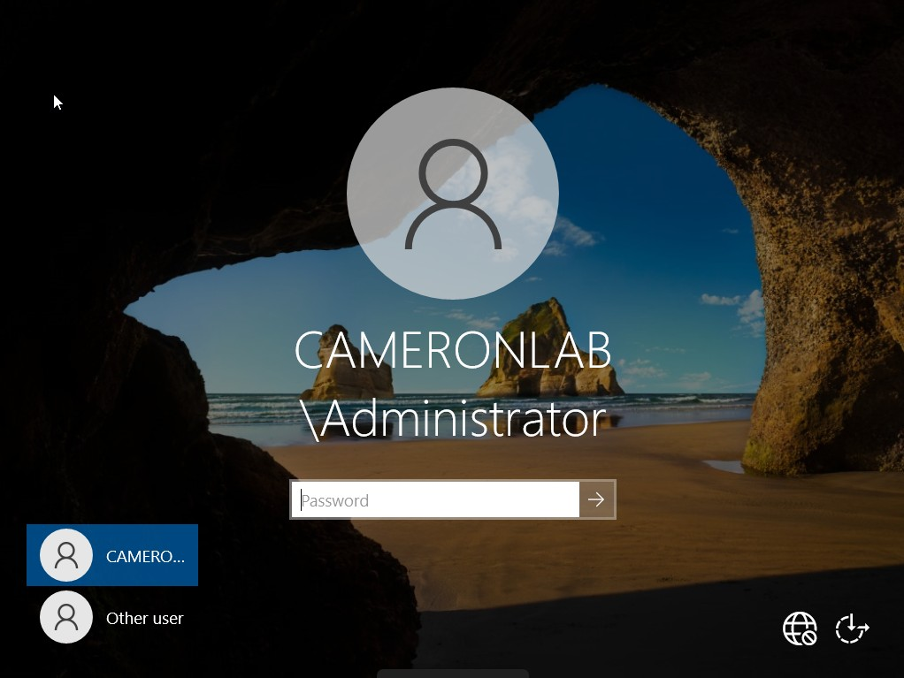
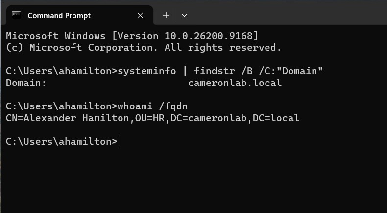
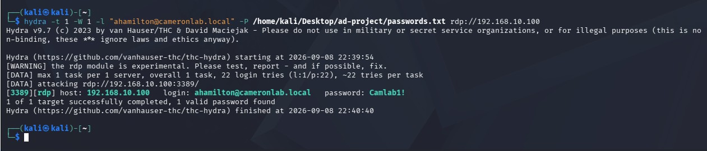
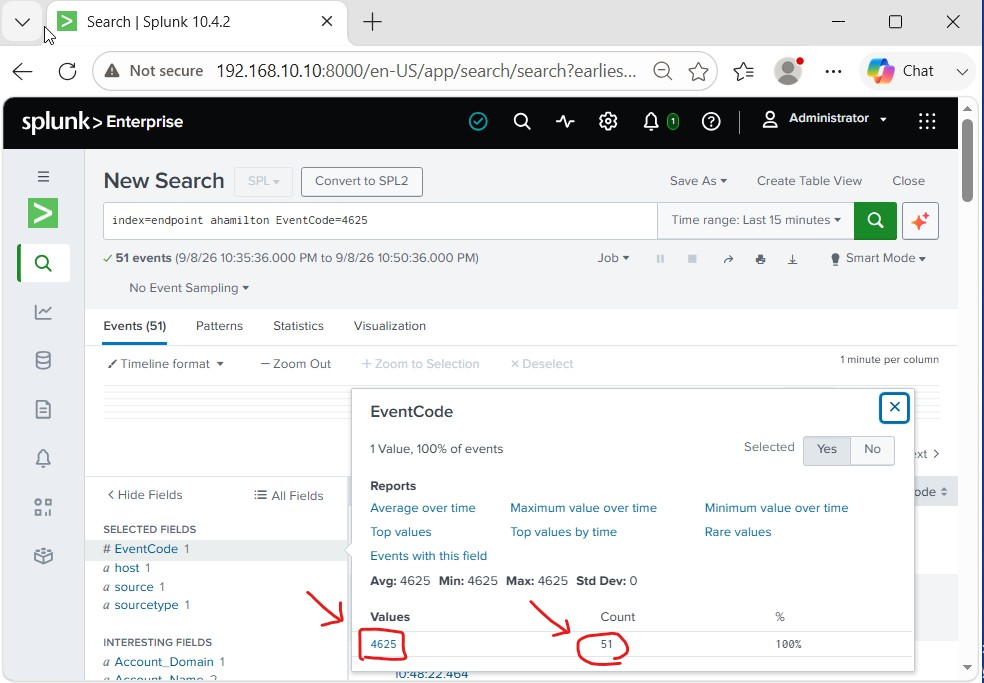
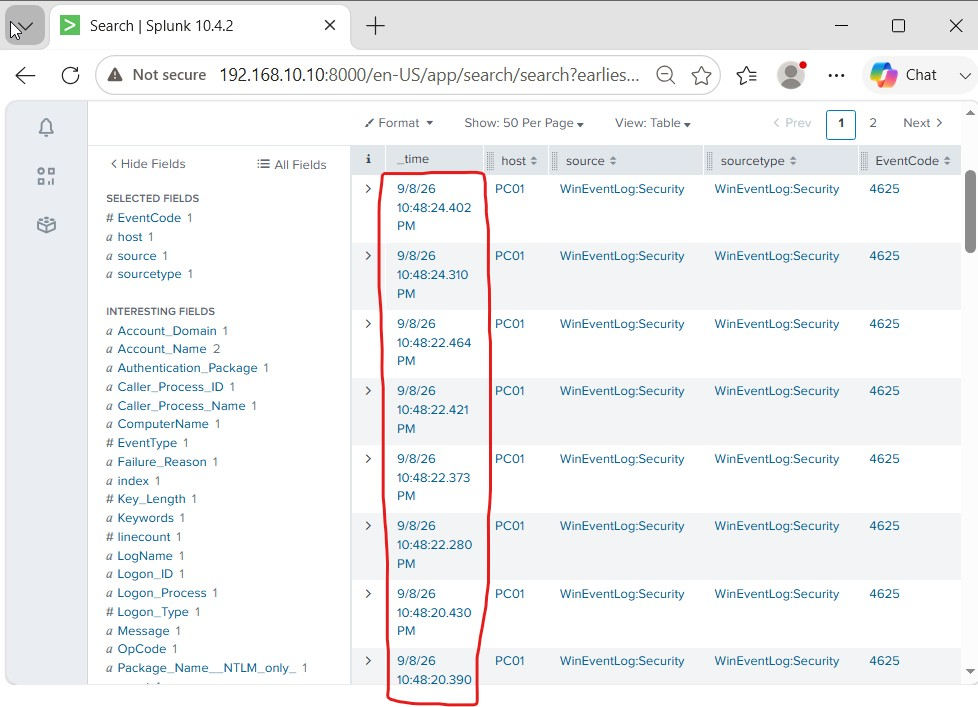
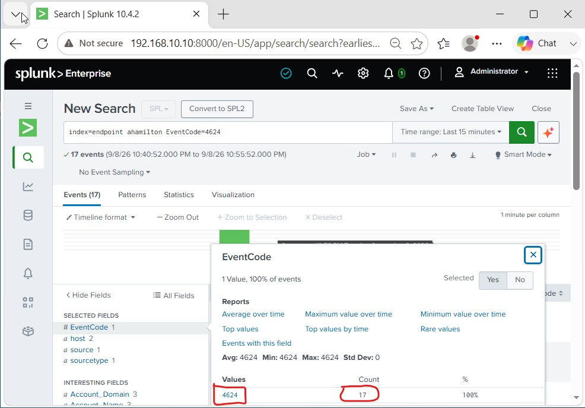
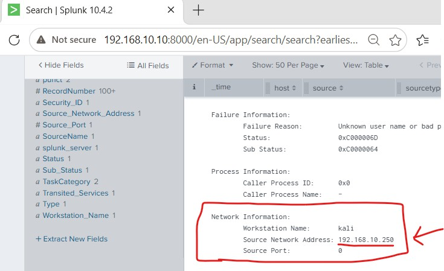

# Active Directory Security Monitoring & SIEM Lab
## Lab Architecture



## Overview

This project implements a virtualized Windows enterprise security lab designed
to demonstrate Active Directory administration, centralized endpoint telemetry,
authentication monitoring, controlled security testing, and SIEM-based
investigation.

The environment was built in Oracle VirtualBox and integrates:

- Windows Server 2022
- Active Directory Domain Services
- Windows 11
- Splunk Enterprise
- Splunk Universal Forwarder
- Microsoft Sysmon
- Kali Linux
- Hydra

Windows Event Logs and Sysmon telemetry were collected from the monitored
Windows systems using Splunk Universal Forwarder and forwarded to a centralized
Splunk Enterprise server.

After the environment was operational, controlled RDP password-guessing
activity was generated from Kali Linux using Hydra. The resulting Windows
authentication events were then investigated in Splunk to identify failed
logons, successful logons, timing patterns, the originating workstation, and
the source IP address.

---

## Project Objectives

The primary objectives of this project were to:

- Build an isolated virtual Windows enterprise environment
- Deploy Active Directory Domain Services
- Configure a Windows Server 2022 Domain Controller
- Create departmental Organizational Units and domain users
- Join a Windows 11 endpoint to the Active Directory domain
- Deploy Splunk Enterprise as a centralized SIEM
- Configure Splunk Universal Forwarder for Windows log collection
- Deploy Sysmon for additional endpoint telemetry
- Centralize Windows Event Logs and Sysmon events in Splunk
- Generate controlled RDP authentication activity using Hydra
- Investigate Windows Security Event IDs `4624` and `4625`
- Analyze authentication timing patterns
- Identify the workstation and source IP responsible for the activity
- Correlate security-testing activity with centralized SIEM telemetry

---

### Network Details

| System | Operating System | Role | IP Address |
|---|---|---|---|
| DC01 | Windows Server 2022 | Active Directory Domain Controller / DNS | `192.168.10.7` |
| SplunkServer | Ubuntu Server | Splunk Enterprise SIEM | `192.168.10.10` |
| PC01 | Windows 11 | Domain-joined monitored endpoint | `192.168.10.100` |
| Kali Linux | Kali Linux | Security-testing workstation | `192.168.10.250` |

**Active Directory Domain:** `cameronlab.local`  
**Virtual Network:** `192.168.10.0/24`  
**Splunk Receiver:** `192.168.10.10:9997`

---

## Environment Overview

Four virtual machines were deployed in Oracle VirtualBox to represent the
primary systems used throughout the lab.


The environment provided separate systems for identity services, endpoint
monitoring, centralized security logging, and controlled security testing.

➡️ **[View Lab Environment Documentation](01-lab-environment/)**

---

## Network Configuration

A VirtualBox NAT network named `CameronLab-NAT` was created using the
`192.168.10.0/24` address space.



Static IP addressing was used for the major lab systems so that services such
as Active Directory, DNS, Splunk forwarding, and security testing could use
consistent addresses.

PC01 was configured to use DC01 as its DNS server so the
`cameronlab.local` domain could be resolved correctly.

➡️ **[View Network Configuration](02-network-configuration/)**

---

## Splunk Enterprise Deployment

Splunk Enterprise was deployed on the Ubuntu server as the centralized SIEM
platform for the environment.

The Splunk web interface was made available at:

`http://192.168.10.10:8000`


Endpoint data was successfully indexed and searchable through Splunk.


➡️ **[View Splunk Enterprise Deployment](03-splunk-deployment/)**

---

## Endpoint Telemetry Collection

Splunk Universal Forwarder was installed on the monitored Windows systems and
configured to send telemetry to the Splunk Enterprise server on TCP port
`9997`.

The telemetry pipeline used in the lab was:

```text
Windows Endpoint
      ↓
Windows Event Logs / Sysmon
      ↓
Splunk Universal Forwarder
      ↓
TCP 9997
      ↓
Splunk Enterprise
      ↓
Search and Investigation
```

The forwarder collected:

- Application Event Logs
- Security Event Logs
- System Event Logs
- Sysmon Operational Logs

Sysmon telemetry was successfully verified inside Splunk.


### Configuration Files

The actual configuration files used in the lab are included in the repository:

- [`inputs.conf`](configs/splunk/inputs.conf) — defines the Windows and Sysmon event sources collected by the Splunk Universal Forwarder
- [`outputs.conf`](configs/splunk/outputs.conf) — defines the Splunk Enterprise receiver at `192.168.10.10:9997`
- [`sysmonconfig.txt`](configs/sysmon/sysmonconfig.txt) — defines the Sysmon monitoring configuration used on the Windows endpoint

➡️ **[View Endpoint Telemetry Documentation](04-endpoint-telemetry/)**

---

## Active Directory Deployment

Active Directory Domain Services was installed on Windows Server 2022 and the
server was promoted to a Domain Controller for:

`cameronlab.local`

The Domain Controller was named:

`DC01`



DC01 also provided DNS services to domain-connected systems.

➡️ **[View Active Directory Deployment](05-active-directory/)**

---

## Domain Users and Endpoint Integration

Two Organizational Units were created to represent departments within the
domain:

| Organizational Unit | User | Username |
|---|---|---|
| IT | Julius Caesar | `jcaesar` |
| HR | Alexander Hamilton | `ahamilton` |

PC01 was joined to `cameronlab.local`, allowing Active Directory users to
authenticate to the Windows 11 endpoint.

Domain membership and user placement were validated using commands such as:

```cmd
systeminfo | findstr /B /C:"Domain"
```

and:

```cmd
whoami /fqdn
```

For example, the HR account returned:

```text
CN=Alexander Hamilton,OU=HR,DC=cameronlab,DC=local
```



➡️ **[View Domain Users and Endpoint Integration](06-domain-users-and-endpoint/)**

---

## Controlled RDP Authentication Testing with Hydra

Kali Linux was configured as the security-testing workstation at:

`192.168.10.250`

Remote Desktop was enabled on PC01 for the selected domain accounts.

Hydra was then used to generate controlled RDP password-guessing activity
against the `ahamilton` domain account on PC01.

Target:

`192.168.10.100`

Protocol:

`RDP`



The test produced multiple failed authentication attempts followed by
successful authentication activity, generating Windows Security events that
could be analyzed in Splunk.

➡️ **[View Controlled RDP Authentication Testing](07-hydra-authentication-test/)**

---

## Splunk Security Investigation

After the controlled Hydra test, Splunk was used to investigate the resulting
authentication activity.

### Failed Authentication — Event ID 4625

The following SPL search was used to identify failed authentication events:

```spl
index=endpoint ahamilton EventCode=4625
```

The search returned repeated Event ID `4625` records associated with the tested
account.



The failed authentication attempts occurred within a highly compressed period
of time, consistent with automated brute-force password-guessing activity.



### Successful Authentication — Event ID 4624

Successful authentication activity was investigated using:

```spl
index=endpoint ahamilton EventCode=4624
```



### Authentication Source Identification

Windows Security event metadata exposed information about the source of the
authentication activity.

Splunk identified:

| Field | Observed Value |
|---|---|
| Workstation Name | `kali` |
| Source Network Address | `192.168.10.250` |



The observed source address matched the statically configured IP address of
the Kali Linux workstation used during the controlled Hydra test.

This allowed the authentication telemetry observed in Splunk to be correlated
back to the system that generated the activity.

➡️ **[View Full Splunk Security Investigation](08-splunk-investigation/)**

---

## Key Findings

The completed lab demonstrated that:

- Active Directory Domain Services was successfully deployed and configured
- PC01 successfully joined the `cameronlab.local` domain
- Domain users could authenticate to the Windows 11 endpoint
- Windows Event Logs were successfully centralized in Splunk
- Sysmon Operational telemetry was successfully ingested into Splunk
- Splunk Universal Forwarder successfully transmitted telemetry to
  `192.168.10.10:9997`
- Controlled Hydra activity generated Windows authentication events
- Event ID `4625` exposed failed authentication attempts
- Event ID `4624` exposed successful authentication activity
- Multiple failed logons occurring within seconds indicated automated
  brute-force password-guessing behavior
- Splunk identified the originating workstation as `kali`
- Splunk identified the source network address as `192.168.10.250`
- The source address matched the Kali Linux workstation used during testing

---

## End-to-End Security Monitoring Workflow

The project demonstrated the complete path from infrastructure deployment to
security investigation:

```text
Build Virtual Environment
        ↓
Configure Networking
        ↓
Deploy Active Directory
        ↓
Create Domain Identities
        ↓
Join Windows Endpoint
        ↓
Deploy Splunk + Sysmon
        ↓
Collect Endpoint Telemetry
        ↓
Generate Controlled Hydra Activity
        ↓
Search Windows Security Events
        ↓
Analyze Authentication Behavior
        ↓
Identify and Correlate the Source
```

---

## Technologies and Skills Demonstrated

| Area | Technologies / Skills |
|---|---|
| Virtualization | Oracle VirtualBox |
| Windows Administration | Windows Server 2022, Windows 11 |
| Identity Management | Active Directory Domain Services, OUs, domain users |
| Networking | IPv4, static addressing, DNS, NAT |
| SIEM | Splunk Enterprise |
| Log Forwarding | Splunk Universal Forwarder |
| Endpoint Telemetry | Sysmon, Windows Event Logs |
| Security Testing | Kali Linux, Hydra, RDP |
| Investigation | SPL, Event IDs 4624/4625, timeline analysis |
| Event Correlation | Source IP identification, workstation attribution |
| Configuration | `inputs.conf`, `outputs.conf`, `sysmonconfig.xml` |

---

## Project Documentation

Detailed technical documentation for each phase of the project is available
below:

| Section | Documentation |
|---|---|
| 01 | [Lab Environment](01-lab-environment/) |
| 02 | [Network Configuration](02-network-configuration/) |
| 03 | [Splunk Enterprise Deployment](03-splunk-deployment/) |
| 04 | [Endpoint Telemetry Collection](04-endpoint-telemetry/) |
| 05 | [Active Directory Deployment](05-active-directory/) |
| 06 | [Domain Users and Endpoint Integration](06-domain-users-and-endpoint/) |
| 07 | [Controlled RDP Authentication Testing with Hydra](07-hydra-authentication-test/) |
| 08 | [Splunk Security Investigation](08-splunk-investigation/) |
| 09 | [Lessons Learned](09-lessons-learned/) |

---

## Lessons Learned

This project reinforced the relationship between infrastructure, identity,
networking, endpoint telemetry, and SIEM investigation.

One of the most valuable takeaways was understanding the complete telemetry
lifecycle:

```text
Endpoint Activity
      ↓
Windows Event Logging / Sysmon
      ↓
Splunk Universal Forwarder
      ↓
Centralized SIEM
      ↓
Search
      ↓
Investigation
      ↓
Event Correlation
```

➡️ **[View Lessons Learned](09-lessons-learned/)**

---

## Repository Structure

```text
active-directory-security-monitoring-siem-lab/
│
├── 01-lab-environment/
│   └── README.md
│
├── 02-network-configuration/
│   └── README.md
│
├── 03-splunk-deployment/
│   └── README.md
│
├── 04-endpoint-telemetry/
│   └── README.md
│
├── 05-active-directory/
│   └── README.md
│
├── 06-domain-users-and-endpoint/
│   └── README.md
│
├── 07-hydra-authentication-test/
│   └── README.md
│
├── 08-splunk-investigation/
│   └── README.md
│
├── 09-lessons-learned/
│   └── README.md
│
├── assets/
│   ├── diagrams/
│   │   └── lab-architecture.jpg
│   └── screenshots/
│
├── configs/
│   ├── splunk/
│   │   ├── inputs.conf
│   │   └── outputs.conf
│   └── sysmon/
│       └── sysmonconfig.xml
│
└── README.md
```

---

## Disclaimer

All security testing documented in this repository was performed against
virtual systems owned and configured specifically for this isolated personal
lab environment.

The authentication-testing activities were performed for educational and
defensive security-learning purposes.
